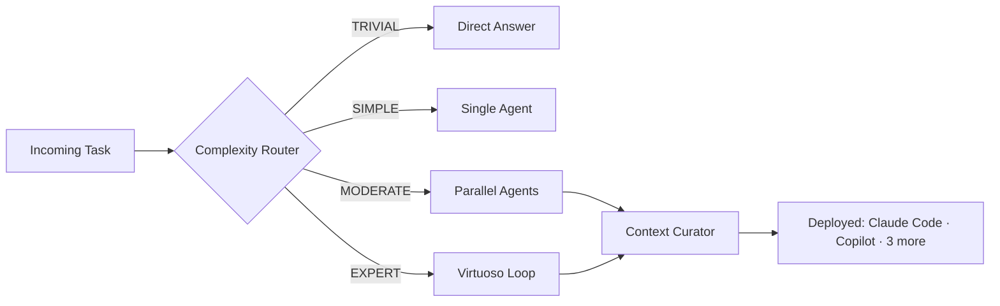

  

  
  &nbsp;
  
  &nbsp;
  
  &nbsp;
  

 

I build AI agents from Cairo that ship production code to [**PowerShell**](https://github.com/PowerShell/PowerShell) (52K stars) while I sleep.
83 skills, a tensor-typed compiler, a multi-agent orchestration system, and a local AI platform -- all shipped from scratch.

 

---

### right now

> shipping bounded-wait timeouts to PowerShell -- 7 source files, an RFC, and 8 adversarial scenarios
>
> teaching Axon to verify tensor shapes before your GPU even warms up
>
> building from Cairo with 83 AI skills and more on the way

---

  

  

 

---

## Open Source Impact &nbsp; 

These aren't typo fixes. Each PR modifies core engine code in [PowerShell](https://github.com/PowerShell/PowerShell), a 52K-star project maintained by Microsoft:

| PR | What changed | Status |
|----|-------------|--------|
| [**Bounded-wait timeouts**](https://github.com/PowerShell/PowerShell/pull/27027) | Added <kbd>Stop(TimeSpan)</kbd>, <kbd>PSInvocationSettings.Timeout</kbd>, and bounded waits across 7 source files. The hosting API can no longer hang forever. [RFC filed.](https://github.com/PowerShell/PowerShell-RFC/pull/409) | In Review |
| [**WindowStyle Hidden fix**](https://github.com/PowerShell/PowerShell/pull/27111) | Fixed [#3028](https://github.com/PowerShell/PowerShell/issues/3028), an 8-year-old bug with 160+ upvotes. Eliminated the console window flash when launching with <kbd>-WindowStyle Hidden</kbd>. | In Review |
| [**UUID v7 default**](https://github.com/PowerShell/PowerShell/pull/27033) | Changed <kbd>New-Guid</kbd> to generate UUID v7 by default. Monotonic, sortable, timestamp-embedded. Modern GUID for a modern shell. | In Review |
| [**Static analysis fixes**](https://github.com/PowerShell/PowerShell/pull/27035) | Fixed 6 PVS-Studio findings across the engine. Null derefs, redundant checks, type narrowing issues. | In Review |
| [**Error handling docs**](https://github.com/MicrosoftDocs/PowerShell-Docs/pull/12890) | Added `about_Error_Handling` reference and fixed error terminology across docs. | **Merged** |

 

---

## What I'm building

<table>
<tr>
<td width="50%" valign="top">

### [Archon](https://github.com/SufficientDaikon/archon) · AI Skills Engine

The core of everything I ship. 83 skills, 10 agents, complexity routing from TRIVIAL to EXPERT, and a virtuoso execution loop that prevents hallucination cascades.

Write a skill once, deploy it on Claude Code, VS Code Copilot, and 3 more platforms. Not a chatbot wrapper -- a cognitive architecture with enforced guardrails.

</td>
<td width="50%" valign="top">

### [Axon](https://github.com/SufficientDaikon/Axon) · ML-First Language

A programming language I designed from scratch for machine learning. Compile-time tensor shape verification, ownership-based memory safety, native GPU execution.

Full lexer, parser, and borrow checker -- written in Rust. If Python and Rust had a child raised by CUDA engineers.

</td>
</tr>
<tr>
<td width="50%" valign="top">

### [HugBrowse](https://github.com/SufficientDaikon/hugbrowse) · Local AI Platform

Browse, download, and run Hugging Face models without sending a byte to the cloud. Tauri v2 (Rust backend) + React frontend. GGUF quantized model support.

Your models. Your machine. Your data.

</td>
<td width="50%" valign="top">

### [Aether](https://github.com/SufficientDaikon/aether) · Multi-Agent Orchestration

28 subsystems. Agents that negotiate, delegate, and self-correct -- built in Bun + TypeScript.

Paused while Axon's borrow checker ships. The architecture is solid and it'll wake back up.

</td>
</tr>
</table>

<strong>Archon routing pipeline</strong>

 

<strong>More projects</strong>

 

> **[axios-scanner](https://github.com/SufficientDaikon/axios-scanner)** -- One-click scanner for the axios npm supply chain attack (March 2026). Detects RAT artifacts, C2 connections, and persistence mechanisms. Built and shipped the day the attack was disclosed.

| Project | What it does |
|---------|-------------|
| **[sdd-vscode-agents](https://github.com/SufficientDaikon/sdd-vscode-agents)** | 13 Copilot Chat agents for spec-driven development. From research to production code with quality gates |
| **[daedalus-debugger](https://github.com/SufficientDaikon/daedalus-debugger)** | Autonomous AI environment debugger. Probes hardware, MCP servers, model capabilities. Self-contained HTML report |
| **[godot-kit](https://github.com/SufficientDaikon/godot-kit)** | AI-powered Godot 4.x development bundle. 9 skill packs, 4 MCP servers |
| **[dissector-agent](https://github.com/SufficientDaikon/dissector-agent)** | Reverse-engineers any codebase into 17+ interlinked documentation files through 13 analysis phases |
| **[adaptive-teacher](https://github.com/SufficientDaikon/adaptive-teacher)** | AI teaching skill that calibrates to learner level in real-time. Socratic questioning, reverse prompting, Egyptian Arabic support |
| **[pr-to-course](https://github.com/SufficientDaikon/pr-to-course)** | Transform any GitHub PR into an interactive HTML course |
| **[copilot-sdk-dissection](https://github.com/SufficientDaikon/copilot-sdk-dissection)** | 14-phase architectural dissection of GitHub's copilot-sdk with interactive docs site |

 

---

## Stats

  

 

  

 

---

If you're building something ambitious -- [tahaa755@gmail.com](mailto:tahaa755@gmail.com)

  

