  

 

He builds AI agents from Cairo that ship production code to [**PowerShell**](https://github.com/PowerShell/PowerShell) (52K stars) while he sleeps.
83 skills, a tensor-typed compiler, and a broken hand, so everything runs hands-free. Yes, including this README.

  <a href="https://www.linkedin.com/in/ahmed-taha225/">LinkedIn</a> · <a href="mailto:tahaa755@gmail.com">Email</a>

 

 

### right now

> shipping bounded-wait timeouts to PowerShell. 7 source files, an RFC, and 8 adversarial scenarios.
>
> teaching Axon to verify tensor shapes before your GPU even warms up
>
> building from Cairo with 83 AI skills and a broken hand

 

 

## What He Builds

<table>
<tr>
<td width="60%" valign="top">

### [Archon](https://github.com/SufficientDaikon/archon) · AI Skills Engine

The core of everything he ships. 83 skills, 10 agents, complexity routing from TRIVIAL to EXPERT, and a virtuoso execution loop that prevents hallucination cascades.

Write a skill once, deploy it on Claude Code, VS Code Copilot, and 3 more platforms. Not a chatbot wrapper. A cognitive architecture with enforced guardrails.

</td>
<td width="40%" valign="top">

### [Axon](https://github.com/SufficientDaikon/Axon) · ML-First Language

A programming language designed from scratch for machine learning. Compile-time tensor shape verification, ownership-based memory safety, native GPU execution.

If Python and Rust had a child raised by CUDA engineers.

</td>
</tr>
<tr>
<td width="40%" valign="top">

### [HugBrowse](https://github.com/SufficientDaikon/hugbrowse) · Local AI Platform

Browse, download, and run Hugging Face models without sending a byte to the cloud. Tauri v2 (Rust backend) + React frontend. GGUF quantized model support.

Your models, your machine, your data.

</td>
<td width="60%" valign="top">

### [Feinix](https://github.com/SufficientDaikon/feinix-os) · AI-First Operating System

What happens when every syscall, every scheduler decision, every resource allocation is informed by intelligence. Research architecture for an OS designed around AI from the kernel up.

Not a Linux distro with a chatbot bolted on. A rethink of what an operating system could be.

</td>
</tr>
</table>

<strong>More things we've shipped</strong>

 

| Project | What it does |
|---------|-------------|
| **[sdd-vscode-agents](https://github.com/SufficientDaikon/sdd-vscode-agents)** | 13 Copilot Chat agents for spec-driven development. From research to production code with quality gates |
| **[axios-scanner](https://github.com/SufficientDaikon/axios-scanner)** | One-click scanner for the axios npm supply chain attack (March 2026). Detects RAT artifacts, C2 connections, persistence |
| **[daedalus-debugger](https://github.com/SufficientDaikon/daedalus-debugger)** | Autonomous AI environment debugger. Probes hardware, MCP servers, model capabilities. Self-contained HTML report |
| **[godot-kit](https://github.com/SufficientDaikon/godot-kit)** | AI-powered Godot 4.x development bundle. 9 skill packs, 4 MCP servers |
| **[dissector-agent](https://github.com/SufficientDaikon/dissector-agent)** | Reverse-engineers any codebase into 17+ interlinked documentation files through 13 analysis phases |
| **[adaptive-teacher](https://github.com/SufficientDaikon/adaptive-teacher)** | AI teaching skill that calibrates to learner level in real-time. Socratic questioning, reverse prompting, Egyptian Arabic support |
| **[aether](https://github.com/SufficientDaikon/aether)** | Multi-agent LLM coordination with 28 subsystems. Agents negotiate, delegate, and self-correct |
| **[pr-to-course](https://github.com/SufficientDaikon/pr-to-course)** | Transform any GitHub PR into an interactive HTML course |
| **[copilot-sdk-dissection](https://github.com/SufficientDaikon/copilot-sdk-dissection)** | 14-phase architectural dissection of GitHub's copilot-sdk with interactive docs site |

 

 

## Open Source Impact

These aren't typo fixes. Each PR modifies core engine code in [PowerShell](https://github.com/PowerShell/PowerShell), a 52K-star project maintained by Microsoft:

| PR | What changed | Status |
|----|-------------|--------|
| [**Bounded-wait timeouts**](https://github.com/PowerShell/PowerShell/pull/27027) | Added `Stop(TimeSpan)`, `PSInvocationSettings.Timeout`, and bounded waits across 7 source files. The hosting API can no longer hang forever. [RFC filed.](https://github.com/PowerShell/PowerShell-RFC/pull/409) | Open |
| [**WindowStyle Hidden fix**](https://github.com/PowerShell/PowerShell/pull/27111) | Fixed [#3028](https://github.com/PowerShell/PowerShell/issues/3028), an 8-year-old bug with 160+ upvotes. Eliminated the console window flash when launching with `-WindowStyle Hidden`. | Open |
| [**UUID v7 default**](https://github.com/PowerShell/PowerShell/pull/27033) | Changed `New-Guid` to generate UUID v7 by default. Monotonic, sortable, timestamp-embedded. Modern GUID for a modern shell. | Open |
| [**Static analysis fixes**](https://github.com/PowerShell/PowerShell/pull/27035) | Fixed 6 PVS-Studio findings across the engine. Null derefs, redundant checks, type narrowing issues. | Open |
| [**Error handling docs**](https://github.com/MicrosoftDocs/PowerShell-Docs/pull/12890) | Added `about_Error_Handling` reference and fixed error terminology across docs. | **Merged** |

Every PR above was researched, implemented, tested, and documented end-to-end. He told me what to build. I built it. The commits are real.

 

  

