<!-- ANIMATED HEADER — capsule-render waving gradient (server-rendered, never breaks) -->

<!-- Typing SVG — cycles through achievements -->

 

 

  

---

### 🧠 About Me

**AI Agent Architect** from Egypt — I build autonomous systems that build software.

- 🤖 LLM orchestration & multi-agent frameworks (49 skills, 7 agents, 5 pipelines)
- 🦀 Systems programming — built a compiler with lexer, parser & borrow checker in Rust
- 🖥️ Full-stack apps with Tauri, React, Django, and Bun
- 🕷️ Data pipelines & web scraping with confidence scoring

> _"If it can be automated, it should be orchestrated by agents."_

---

### 🔭 Currently Working On

- 🌀 **[Aether](https://github.com/SufficientDaikon/aether)** — Scaling to 28+ subsystems for autonomous agent orchestration
- 🧩 **[OMNISKILL](https://github.com/SufficientDaikon/omniskill)** — Expanding cross-platform AI skills to 49+ across 5 editors
- 🧬 **[Axon](https://github.com/SufficientDaikon/Axon)** — Building a complete ML/AI-first language compiler in Rust

---

### 🚀 Featured Projects

  
  
  
  
  
  

---

### 🛠️ Tech Stack

**Languages**

**Frameworks & Libraries**

**Tools & Infrastructure**

**AI & ML**

---

### 🔥 Streak & Activity

  
  

---

### 💻 Languages & Lines of Code

  
  

---

### 📈 Contribution Graph

---

### ⭐ Star History

<a href="https://star-history.com/#SufficientDaikon/aether&SufficientDaikon/omniskill&SufficientDaikon/hugbrowse&SufficientDaikon/harvesthub&SufficientDaikon/Axon&SufficientDaikon/sdd-vscode-agents&Date">
  <picture>
    <source media="(prefers-color-scheme: dark)" srcset="https://api.star-history.com/svg?repos=SufficientDaikon/aether,SufficientDaikon/omniskill,SufficientDaikon/hugbrowse,SufficientDaikon/harvesthub,SufficientDaikon/Axon,SufficientDaikon/sdd-vscode-agents&type=Date&theme=dark" />
    <source media="(prefers-color-scheme: light)" srcset="https://api.star-history.com/svg?repos=SufficientDaikon/aether,SufficientDaikon/omniskill,SufficientDaikon/hugbrowse,SufficientDaikon/harvesthub,SufficientDaikon/Axon,SufficientDaikon/sdd-vscode-agents&type=Date" />
    
  </picture>
</a>

---

🐍 Watch the contribution snake eat my graph

 

<picture>
  <source media="(prefers-color-scheme: dark)" srcset="https://raw.githubusercontent.com/SufficientDaikon/SufficientDaikon/output/github-contribution-grid-snake-dark.svg" />
  <source media="(prefers-color-scheme: light)" srcset="https://raw.githubusercontent.com/SufficientDaikon/SufficientDaikon/output/github-contribution-grid-snake.svg" />
  
</picture>

---

_I build AI agents that build software. The future is agentic._ ✨

<!-- FOOTER WAVE -->

<!-- SEO Keywords: Ahmed Taha, SufficientDaikon, AI agents, LLM orchestration, multi-agent systems, full-stack developer, Python, TypeScript, Rust, open source, developer tools, spec-driven development, OMNISKILL, Aether, GitHub Copilot, Claude Code, Cursor, Windsurf -->
